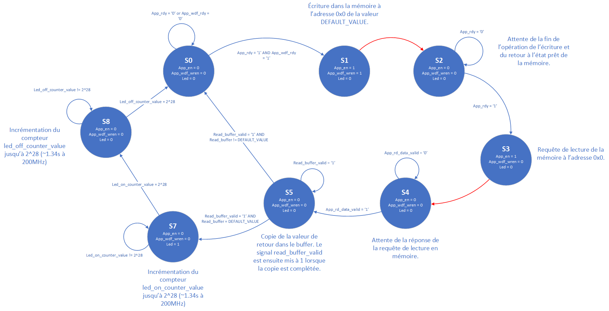

**Semaine du 09 Juillet 2021**

**Objectifs:** 
- Développer une interface simple pour l'écriture et la lecture de données vers la RAM DDR3 SODIMM présente sur la carte ZC706.

**Ressources consultées:** 
- [Zynq-7000 SoC and 7 Series Devices Memory Interface Solutions v4.2 (.pdf)](https://www.xilinx.com/support/documentation/ip_documentation/mig_7series/v4_2/ug586_7Series_MIS.pdf)
- [ZC706 MIG Design Creation (.pdf)](https://www.xilinx.com/support/documentation/boards_and_kits/zc706/2014_4/xtp244-zc706-mig-c-2014-4.pdf)
- [What is AXI? (YouTube Playlist, Dillon Huff)](https://www.youtube.com/watch?v=1zw1HBsjDH8&list=PLaSdxhHqai2_7WZIhCszu5PLSbZURmibN)
- [Advanced eXtensible Interface (Wikipedia)](https://en.wikipedia.org/wiki/Advanced_eXtensible_Interface)

**Tâches effectuées 08 Juillet 2021**
**Interface MIG7**

**Tâches effectuées 09 Juillet 2021**
- Rédaction d'un design VHDL d'une machine à état simple: 

Cette machine à état permet d'exploiter la mémoire DDR3 présente sur la carte ZC706. On effectue tout d'abord une écriture en mémoire d'une valeur DEFAULT_VALUE à l'adresse 0x0. Par la suite, on effectue une lecture à cette même adresse. La valeur lue est stockée dans un registre buffer. La valeur de ce registre est comparé avec la valeur attendue (DEFAULT_VALUE) et dans le cas où les deux valeurs correspondent, une LED est allumée pour une durée approximative de 1.34s (un compteur est incrémenté jusqu'à 2^28, à 200MHz). Par la suite, la LED est éteinte pendant 1.34s (un compteur allant jusqu'à 2^28 est à nouveau utilisé). Dans le cas où les deux valeurs ne sont pas identiques, la LED ne s'allume pas et on retourne à l'état initial S0.\
Si l'accès en memoire fonctionne correctement, la LED doit clignoter avec une intervalle ~1.34s (on considère les accès en mémoire quasi instantanés dans notre cas).

Les prochaines tâches à venir sont les accès à la mémoire en mode BURST, dans le but d'être exploité pour l'accélération de logiciel. Les standards AXI seront à étudier pour cette application.