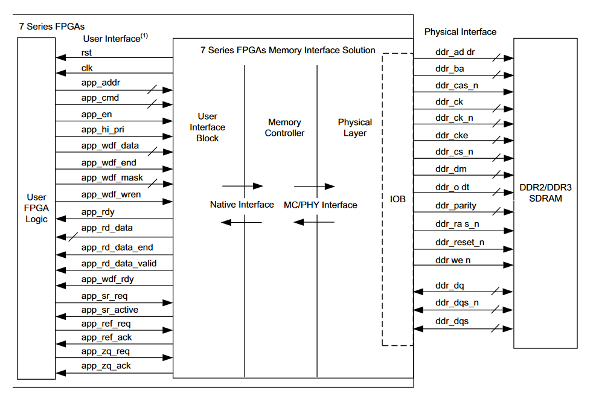

**Semaine du 09 Juillet 2021**

**Objectifs:** 
- Développer une interface simple pour l'écriture et la lecture de données vers la RAM DDR3 SODIMM présente sur la carte ZC706.

**Ressources consultées:** 
- [Zynq-7000 SoC and 7 Series Devices Memory Interface Solutions v4.2](https://www.xilinx.com/support/documentation/ip_documentation/mig_7series/v4_2/ug586_7Series_MIS.pdf)
- [What is AXI? (YouTube Playlist, Dillon Huff)](https://www.youtube.com/watch?v=1zw1HBsjDH8&list=PLaSdxhHqai2_7WZIhCszu5PLSbZURmibN)
- [Advanced eXtensible Interface (Wikipedia)](https://en.wikipedia.org/wiki/Advanced_eXtensible_Interface)

**Tâches effectuées 08 Juillet 2021**
**Interface MIG7**

**Tâches effectuéees 09 Juillet 2021**