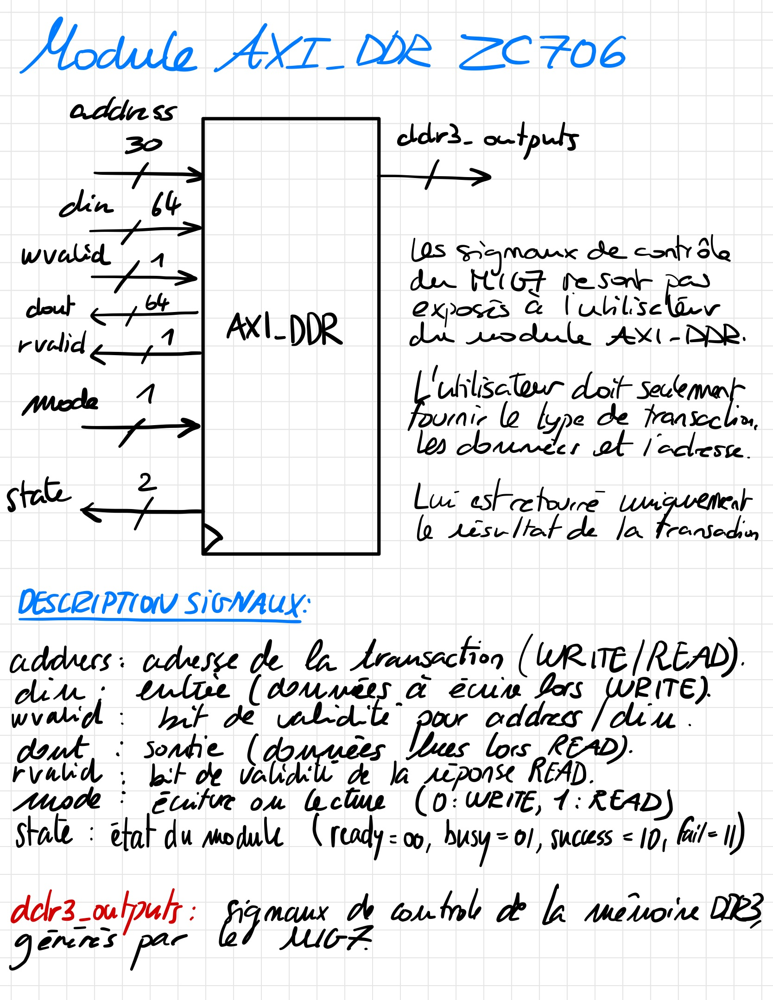
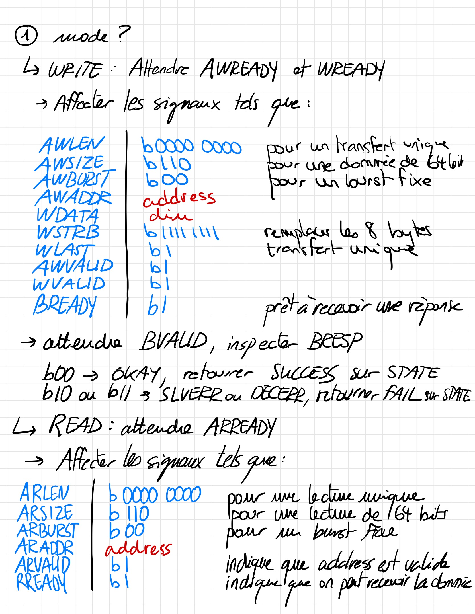
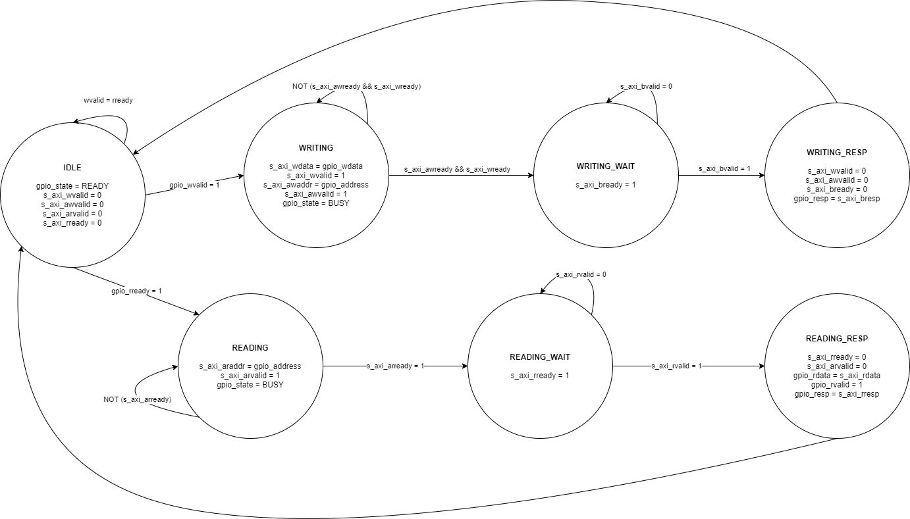

**Semaine du 16 Juillet 2021**

**Objectifs:** 
- Développer une interface en Verilog (contrainte du MIG de Xilinx, ne produit qu'un module Verilog lorsque les fonctionnalités AXI sont sélectionnées) pour exploiter les écritures et lectures en mode **burst** du protocole AXI.

**Ressources consultées:** 
- [Verilog HDL Basics (.pdf)](http://www.ee.ic.ac.uk/pcheung/teaching/ee2_digital/Altera%20Tutorial%20-%20Verilog%20HDL%20Basic.pdf)
- [AMBA AXI and ACE Protocol Specification AXI3, AXI4, and AXI4-Lite ACE and ACE-Lite (web)](https://developer.arm.com/documentation/ihi0022/e/AMBA-AXI3-and-AXI4-Protocol-Specification/Introduction?_ga=2.67820049.1631882347.1556009271-151447318.1544783517)

**Tâches effectuées 13 Juillet 2021**
- Apprentissage bref des bases du langage Verilog (formation offerte par Altera/Intel). 
- Adaptation d'un simple programme d'interaction entre un bouton poussoir et une LED de la ZC706 en Verilog.
- Création d'un projet Verilog sur Vivado, instanciation et branchement d'un contrôleur exploitant le protocole AXI et la DDR3.
- Définition des fonctionnalités à implémenter:
\
Le design doit permettre une interaction entre l'hôte (PC), le processeur ARM de la ZC706, et le FPGA. Le processeur ARM est programmé de telle sorte à interfacer l'hôte et le FPGA. Le processeur demande la commande (READ/WRITE) à exécuter, l'utilisateur effectue son choix et renseigne les signaux importants (adresse, valeur). Le processeur ARM transmet les choix de l'utilisateur au FPGA qui effectue les opérations souhaitées et signale le résultat de chaque opération. Dans le cas d'une opération de lecture, le processeur ARM affiche à l'hôte le contenu de la mémoire à l'emplacement demandé.\
On vise pour l'instant une interaction au travers d'un terminal, via UART, entre l'hôte et le processeur ARM.

---

**Tâches effectuées 14 Juillet 2021**

**Étude du standard AXI4:**\
Une **transaction** consiste en l'échange de signaux de contrôles entre le **Master** et le **Slave**, d'un **burst** (envoie unique d'un ensemble de données, chaque donnée envoyéee consiste en un **beat**).

**OPÉRATION WRITE**

**ADRESSE** (parmi d'autres, [cf](https://developer.arm.com/documentation/ihi0022/e/AMBA-AXI3-and-AXI4-Protocol-Specification/Signal-Descriptions/Write-address-channel-signals?lang=en)):
| SIGNAL  | Source |Description |
|---------| - | ----------------------------------------------|
| AWADDR  | M | Adresse de départ pour l'opération de WRITE. |
| AWLEN   | M | Nombre de transferts dans un BURST.          |
| AWSIZE  | M | Taille de chaque transferts dans un BURST.   |
| AWBURST | M | Type de BURST (FIXED, INCR, WRAP).           |
| AWVALID | M | Indique que l'adresse d'écriture est valide. |
| AWREADY | S | État du Slave (prêt ou non à recevoir une adresse). |

**DONNÉES** (parmi d'autres, [cf](https://developer.arm.com/documentation/ihi0022/e/AMBA-AXI3-and-AXI4-Protocol-Specification/Signal-Descriptions/Write-data-channel-signals?lang=en)):

| SIGNAL  | Source |Description |
|---------| - | ----------------------------------------------|
| WDATA  | M | Données à écrire. |
| WSTRB   | M | Bytes valides (à modifier via écriture), la taille de ce signal est égale à la taille du bus de données / 8.          |
| WLAST  | M | Indique le dernier transfert dans un BURST.   |
| WVALID | M | Indique que les signaux WDATA et WSTRB sont valides.           |
| WREADY | S | État du Slave (prêt ou non à recevoir des données). |

Les signaux de **réponses** sont les [suivants](https://developer.arm.com/documentation/ihi0022/e/AMBA-AXI3-and-AXI4-Protocol-Specification/Signal-Descriptions/Write-response-channel-signals?lang=en) (parmi d'autres):

| SIGNAL  | Source |Description |
|---------| - | ----------------------------------------------|
| BRESP | S | Indique le status de la transaction WRITE. |
| BVALID | S | Indique que la réponse est valide. |
| BREADY | M | Le Master indique si il est prêt ou non à recevoir une réponse. |

---
---

**OPÉRATION READ**

**ADRESSE** (parmi d'autres, [cf](https://developer.arm.com/documentation/ihi0022/e/AMBA-AXI3-and-AXI4-Protocol-Specification/Signal-Descriptions/Read-address-channel-signals?lang=en)):

| SIGNAL  | Source |Description |
|---------| - | ----------------------------------------------|
| ARADDR | M | Adresse de départ pour l'opération de READ. |
| ARLEN | M | Nombre de transferts dans un BURST. |
| ARSIZE | M | Taille de chaque transfert dans un BURST. |
| ARBURST | M | Type de BURST (FIXED, INCR, WRAP). |
| ARVALID | M | Indique que l'adresse de lecture est valide. |
| ARREADY | S | État du Slave (prêt ou non à recevoir une adresse pour READ). |

**DONNÉES** (parmi d'autres, [cf](https://developer.arm.com/documentation/ihi0022/e/AMBA-AXI3-and-AXI4-Protocol-Specification/Signal-Descriptions/Read-data-channel-signals?lang=en)):

| SIGNAL  | Source |Description |
|---------| - | ----------------------------------------------|
| RDATA | S | Données lues. |
| RRESP | S | État de la transaction READ. |
| RLAST | S | Indique le dernier transfert dans un BURST. |
| RVALID | S | Indique que la donnée RDATA est valide. |
| RREADY | M | Le Master indique si il est prêt où non à recevoir les données du READ. |

---

Lors de l'opération **RESET**, il faut que les signaux ARVALID, AWVALID, et WVALID soient dirigés par les Master à la valeur 0 (LOW), et que les signaux  RVALID et BVALID soient dirigés par les Slaves à la valeur 0 (LOW).

**PROTOCOLE HANDSHAKE ET RESPECT DES SIGNAUX READY/VALID**

Les transactions sont effectuées en respectant le principe de **HANDSHAKE**. Tant que la SOURCE n'émet pas un signal **VALID = 1** ou que la DESTINATION n'émet pas un signal **READ = 1**, la transaction n'a pas lieu. Il faut que les deux signaux de part et d'autre de la transaction soient dirigés à 1 (HIGH).

Une source ne peut attendre le signal READY pour passer son signal VALID à HIGH. Par contre, une destination peut attendre le signal VALID pour passer son signal READY à HIGH.

Paires de signaux pour HANDSHAKE:

| TRANSACTION  | Paire |
|---------| - |
| WRITE address | AWVALID, AWREADY |
| WRITE data | WVALID, WREADY |
| WRITE response | BVALID, BREADY |
| READ address | ARVALID, ARREADY |
| READ data | RVALID, RREADY |

---

**ARLEN et AWLEN** sont tels que en réalité, le nombre de transferts dans un BURST correspond à AxLEN[7:0] + 1. Donc si on veut un nombre de transferts égal à 4, il faut que AxLEN[7:0] = 0000 0011 ( = 3). Un BURST ne doit pas couvrir une zone en mémoire dont la taille excède 4KB d'adresses.

**AxSIZE[2:0]** indique le nombre de bytes tranférés dans chaque BEAT d'un BURST:
| AxSIZE[2:0] | Nombre de bytes transférés / BEAT |
| - | - |
| 0b000 | 1 |
| 0b001  | 2 |
| 0b010  | 4 |
| 0b011  | 8 |
| 0b100  | 16 |
| 0b101  | 32 |
| 0b110  | 64 |
| 0b111  | 128 |

**AxBURST[1:0]** indique le type du BURST:
| AxBURST[1:0] | Type de BURST |
| - | - |
| 0b00 | FIXED |
| 0b01 | INCR |
| 0b10 | WRAP |
| 0b11 | Reservé |

**xRESP[1:0]** indique l'état de la transaction [cf](https://developer.arm.com/documentation/ihi0022/e/AMBA-AXI3-and-AXI4-Protocol-Specification/Single-Interface-Requirements/Transaction-structure/Read-and-write-response-structure?lang=en):
| xRESP[1:0] | État de la transaction |
| - | - |
| 0b00 | OKAY: Succès |
| 0b01 | EXOKAY: Succès accès exclusif |
| 0b10 | SLVERR: Erreur au niveau du Slave |
| 0b11 | DECERR: Erreur au niveau du Decode, absence de Slave à l'adresse de transaction |

**Tâches effectuées 15 Juillet 2021**
- Développement d'une plateforme matérielle (Vivado) permettant l'interaction entre le PS et le PL. Le PL fonctionne come une FSM, en reçevant une entrée, si cette entrée est supérieure à 1807 alors une LED est allumée, sinon la LED est éteinte.
- Développement du firmware du ARMv9 permettant d'interagir entre le Terminal UART et le PL. Le firmware reçoit une entrée sur le Terminal UART et converti cette entrée en une valeur entiere sur 32 bits avant de la transmettre au PL.
- Planification du design permettant des accès en mémoire DDR via le Terminal UART en exploitant le protocole UART. Ce design n'exploite pas encore les BURST.\

**Tâches effectuées 16 Juillet 2021**
- Développement d'une interface VHDL (le module Verilog MIG7 n'est pas incorporable dans un code Verilog pour une intégration dans un diagram à partir d'un module Verilog) permettant le lien entre le ARMv9 et le MIG7 utilisant le protocole AXI4.
- Conception d'une machine à état:\

TODO: Vérification de l'interface VHDL (signaux de contrôle, transition entre les états...).