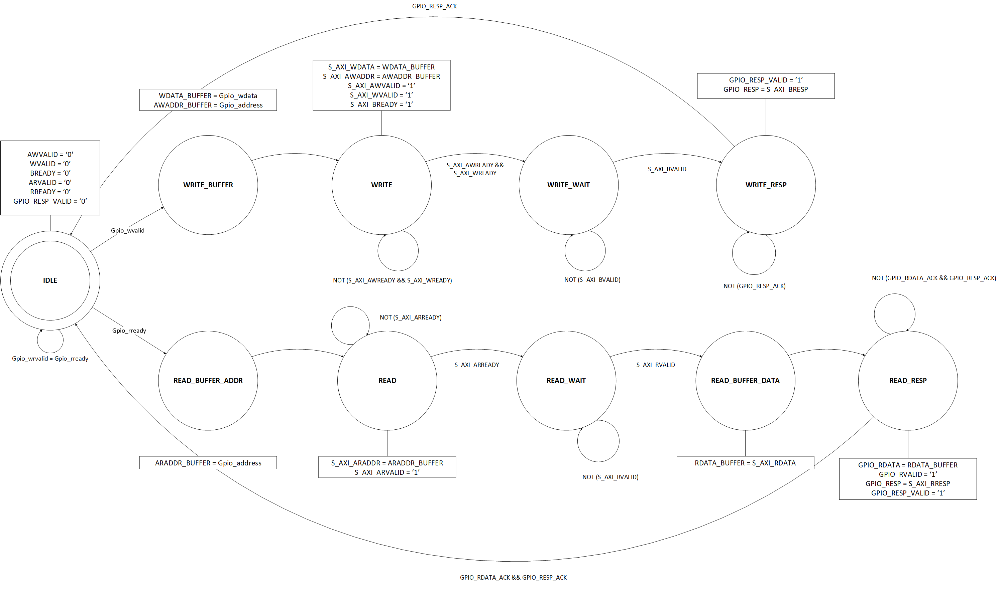

**Semaine du 23 Juillet 2021**

**Objectifs:** 
- Développer une interface en Verilog (contrainte du MIG de Xilinx, ne produit qu'un module Verilog lorsque les fonctionnalités AXI sont sélectionnées) pour exploiter les écritures et lectures en mode **burst** du protocole AXI.

**Ressources consultées:** 

**Tâches effectuées 21, 22, 23 Juillet 2021**

Réalisation d'un design VHDL sous la forme d'une machine à état:\

Cette machine à état effectue ses transitions en fonction d'entrées envoyées depuis le processeur ARMv9 embarqué sur le ZYNQ. L'utilisateur intéragit avec le Terminal sur le port COM3 depuis l'application développée en C avec Vitis.

Possibilité d'effectuer une opération de lecture ou d'écriture simple à une adresse donnée. Le bouton RESET (Active LOW) doit être couplé à un système de debounce pour éviter les instabilités.
